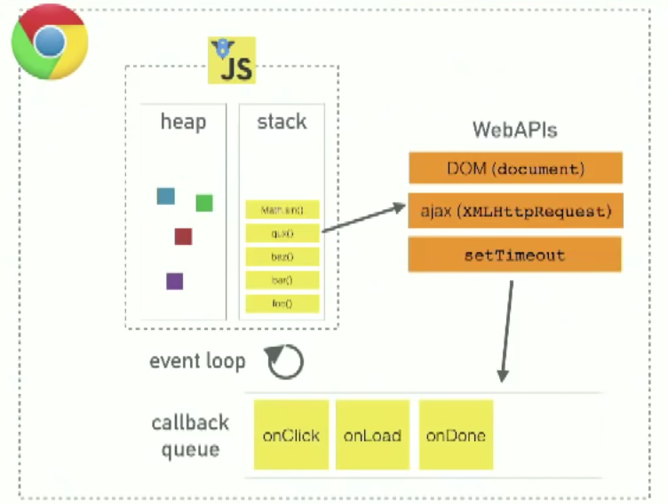
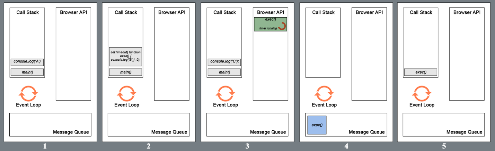
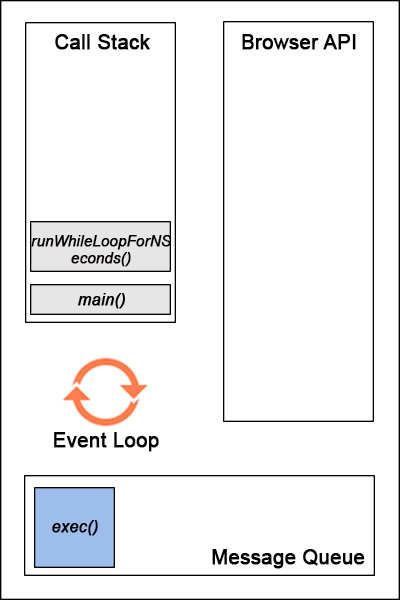

# EventLoop Synchronious code &#x1F34E;

## Basic Architecture 



    •	Heap - Objects are allocated in a heap which is just a name to denote a large mostly unstructured region of memory

    •	Stack - This represents the single thread provided for JavaScript code execution. Function calls form a stack of frames.

    •	Browser or Web APIs are built into your web browser, and are able to expose data from the browser and surrounding computer environment and do useful complex things with it. They are not part of the JavaScript language itself, rather they are built on top of the core JavaScript language, providing you with extra superpowers to use in your JavaScript code

In the background, the browser is actually using some complex lower-level code (e.g. C++) to communicate with the device’s GPS hardware (or whatever is available to determine position data), retrieve position data, and return it to the browser environment to use in your code. But again, this complexity is abstracted away from you by the API

## Asynchronous execution

```javascript
function main(){
  console.log('A');
  setTimeout(
    function display(){ console.log('B'); }
  ,0);
	console.log('C');
}
main();
//	Output
//	A
//	C
//  B

```
## Explanation of the example 1 through image



1.	The call to the main function is first pushed into the stack (as a frame). Then the browser pushes the first statement in the main function into the stack which is console.log(‘A’). This statement is executed and upon completion that frame is popped out. Alphabet A is displayed in the console.

2.	The next statement (setTimeout() with callback exec() and 0ms wait time) is pushed into the call stack and execution starts. setTimeout function uses a Browser API to delay a callback to the provided function. The frame (with setTimeout) is then popped out once the handover to browser is complete (for the timer).

3.	console.log(‘C’) is pushed to the stack while the timer runs in the browser for the callback to the exec() function. In this particular case, as the delay provided was 0ms, the callback will be added to the message queue as soon as the browser receives it (ideally).

4.	After the execution of the last statement in the main function, the main() frame is popped out of the call stack, thereby making it empty. For the browser to push any message from the queue to the call stack, the call stack has to be empty first. That is why even though the delay provided in the setTimeout() was 0 seconds, the callback to exec() has to wait till the execution of all the frames in the call stack is complete.

5.	Now the callback exec() is pushed into the call stack and executed. The alphabet C is display on the console. This is the event loop of javascript.
So the delay parameter in setTimeout(function, delayTime) does not stand for the precise time delay after which the function is executed. It stands for the minimum wait time after which at some point in time the function will be executed.

```javascript
function main(){
  console.log('A');
  setTimeout(
    function exec(){ console.log('B'); }
  , 0);
  runWhileLoopForNSeconds(3);
  console.log('C');
}

main();

function runWhileLoopForNSeconds(sec){
  let start = Date.now(), now = start;
  while (now - start < (sec*1000)) {
    now = Date.now();
  }
}

// Output
// A
// C
// B

```



•	The function runWhileLoopForNSeconds() does exactly what its name stands for. It constantly checks if the elapsed time from the time it was invoked is equal to the number of seconds provided as the argument to the function. The main point to remember is that while loop (like many others) is a blocking statement meaning its execution happens on the call stack and does not use the browser APIs. So it blocks all succeeding statements until it finishes execution.

•	So in the above code, even though setTimeout has a delay of 0s and the while loop runs for 3s, the exec() call back is stuck in the message queue. The while loop keeps on running on the call stack (single thread) until 3s has elapsed. And after the call stack becomes empty the callback exec() is moved to the call stack and executed.

•	So the delay argument in setTimeout() does not guarantee the start of execution after timer finishes the delay. It serves as a minimum time for the delay part.


# Callback Promises and Async/Await &#x1F34E;

## Callback
What is a Callback?
Simply put: A callback is a function that is to be executed after another function has finished executing — hence the name ‘call back’.

More complexly put: In JavaScript, functions are objects. Because of this, functions can take functions as arguments, and can be returned by other functions. Functions that do this are called higher-order functions. Any function that is passed as an argument is called a callback function.

Why do we need Callbacks?
For one very important reason — JavaScript is an event driven language. This means that instead of waiting for a response before moving on, JavaScript will keep executing while listening for other events.

```javascript
function first(){
  // Simulate a code delay
  setTimeout( function(){
    console.log(1);
  }, 500 );
}
function second(){
  console.log(2);
}
first();
second();


//Simple callback

function doHomework(subject, callback) {
  alert(`Starting my ${subject} homework.`);
  callback();
}

doHomework('math', function() {
  alert('Finished my homework');
});

```
## Promise
The Promise object represents the eventual completion (or failure) of an asynchronous operation, and its resulting value.

```javascrip
var promise1 = new Promise(function(resolve, reject) {
  setTimeout(function() {
    resolve('foo');
  }, 300);
});

promise1.then(function(value) {
  console.log(value);
  // expected output: "foo"
});

//Syntax
//new Promise( /* executor */ function(resolve, reject) { ... } );

//Example:
let promise = loadScript("https://cdnjs.cloudflare.com/ajax/libs/lodash.js/3.2.0/lodash.js");

promise.then(
  script => alert(`${script.src} is loaded!`),
  error => alert(`Error: ${error.message}`)
);

promise.then(script => alert('One more handler to do something else!'));

```

## Async/await

There’s a special syntax to work with promises in a more comfortable fashion, called “async/await”. It’s surprisingly easy to understand and use.

```javascript
async function f() {
  return 1;
}


async function f() {
  return 1;
}

f().then(alert); // 1

async function f() {
  return Promise.resolve(1);
}

f().then(alert); // 1


async function f() {

  let promise = new Promise((resolve, reject) => {
    setTimeout(() => resolve("done!"), 1000)
  });

  let result = await promise; // wait till the promise resolves (*)

  alert(result); // "done!"
}

f();


//Example:

async function showAvatar() {

  // read our JSON
  let response = await fetch('/article/promise-chaining/user.json');
  let user = await response.json();

  // read github user
  let githubResponse = await fetch(`https://api.github.com/users/${user.name}`);
  let githubUser = await githubResponse.json();

  // show the avatar
  let img = document.createElement('img');
  img.src = githubUser.avatar_url;
  img.className = "promise-avatar-example";
  document.body.append(img);

  // wait 3 seconds
  await new Promise((resolve, reject) => setTimeout(resolve, 3000));

  img.remove();

  return githubUser;
}

showAvatar();
```
