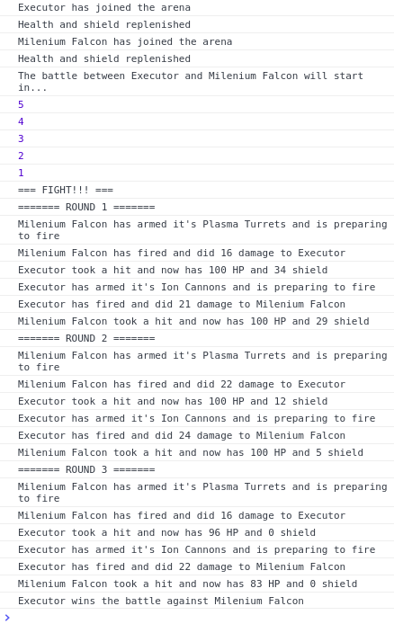

# Starship Battle

### Create starships to battle in the arena

##### What we need?

First of all we need to create our ships which will have some predefined values

```JavaScript
// example ship
{
    name: 'Ship name',
    crew: 'crew count',
    weapon: 'Weapon of choice',
    health: 100 // this value will be hardcoded
    shield: 50 // this value will be hardcoded
    stats: { // these values will be hardcoded with 0
        wins: 0,
        losses: 0,
        draw: 0
    },
    fireWeapon() {
        let damage = 10-20 // should make random damage between 10 and 20
        return damage
    }
    // ... more methods if needed
}
```

The goal is to create a simple game where the user will pick two ships to battle in the arena (in the console)
After the two ships are selected and Start battle is clicked, the battle in the console should start, by console.log-ing actions as they are imagined to happen one by one with some `delay`
We will need to use `setTimeout()` and `async/await` probably, to achieve the wanted delay
The battle will be executed in turns/rounds and the ship that will have more hp will be declared a winner and each ship's stats will be updated acordingly
* when a ship fires its weapon it will do random damage between 10 and 20 and the ammount should be subtracted first from the opponent's shields then from health
* keep in mind that if the shield is at 14 capacity and the ship takes 19 damage the difference should be taken out of the ship's health, health and shield ammounts shouldn't go below 0
* the arena will be a function that accepts the two ships as parameters and generates outputs in `console.log` with the corresponding actions while also taking care of updating the ships health, shield and stats values
* ships health and shields should be reset/replenished before the start of each battle
* There should be a leaderboard table on the screen that will display all the ships and their stats
* The leaderboard should be updated with the new values after each battle/or by clicking a button and the ships should be sorted by wins in descending order

##### Example output in console


